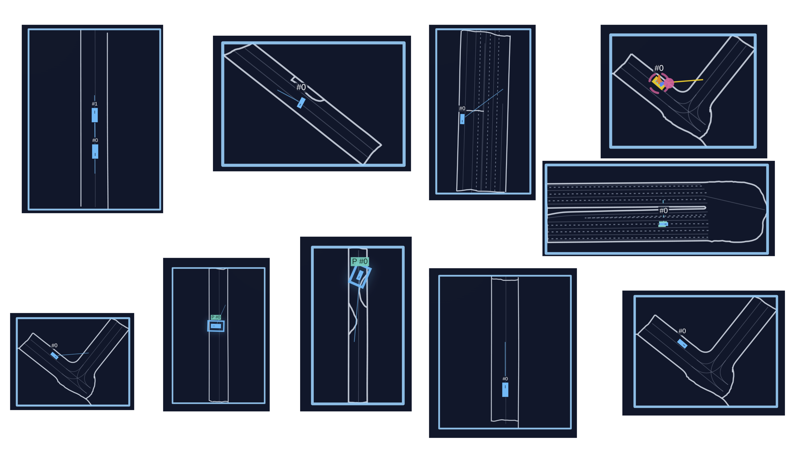

# Evaluations and benchmarks

Driving is a safety-critical multi-agent application, making careful evaluation and risk assessment essential. Mistakes in the real world are costly, so simulations are used to catch errors before deployment. To support rapid iteration, evaluations should ideally run efficiently. This is why we also paid attention to optimizing the speed of the evaluations. This page contains an overview of the available benchmarks and evals.

## Evaluate all 150 test scenes

Run these commands from the repository root. First convert the raw test JSON
scenes and verify the resource link (once, before evaluation):

```bash
python pufferlib/ocean/drive/drive.py \
  --data-folder /mnt/cpfs-c-300t/mnt/cpfs-wlc-rdma-300t/GPUDrive_mini/testing \
  --output-dir /mnt/cpfs-c-300t/mnt/cpfs-wlc-rdma-300t/GPUDrive_mini/resources/drive/binaries/testing \
  --workers 8
readlink -f resources/drive/binaries/testing
```

The existing converter reads JSON scenes from
`/mnt/cpfs-c-300t/mnt/cpfs-wlc-rdma-300t/GPUDrive_mini/testing` and writes
`map_000.bin` through `map_149.bin` to
`/mnt/cpfs-c-300t/mnt/cpfs-wlc-rdma-300t/GPUDrive_mini/resources/drive/binaries/testing`.
The expected test split contains 150 JSON scenes. The existing training resource
symlink makes `resources/drive/binaries/testing` resolve to the binary directory
above; verify this with the `readlink` command. Conversion does not change links.
Missing input or failed conversions raise an error. The evaluator verifies that
all 150 numbered binaries are present. Running the converter without arguments
keeps the original training conversion defaults.

Then run the standalone evaluator:

```bash
python setup.py build_ext --inplace --force
python scripts/evaluate_test.py \
  --checkpoint /path/to/model.pt
```

The default test directory is `resources/drive/binaries/testing`, which resolves
through the resource link to the binary directory above. The default
output directory is `/mnt/cpfs-c-300t/mnt/cpfs-wlc-rdma-300t/results`.
Override them with `--test-dir` and `--output-dir` when needed.
The default device is `cuda:0`; override it with `--device` when needed.

The test directory must contain exactly `map_000.bin` through `map_149.bin`,
with distinct scenario IDs and valid SDC indices for human-replay.
Use `--num-maps N` for a different dataset size.
These must be converted map binaries containing reference trajectories and
`tracks_to_predict` metadata for WOSAC, not raw JSON files or a challenge split
whose future reference trajectories are unavailable.

The script loads each map once per evaluation pass, without random map sampling
or partial scenes. All three passes (self-play, human-replay, and WOSAC) always
run, independently of the INI's evaluation enable flags. By default it processes
8 complete scenes per batch, runs one self-play episode and one human-replay
episode per scene, and collects 32 WOSAC rollouts per scene. Use `--batch-size`,
`--driving-rollouts`, and `--wosac-rollouts` to adjust those counts.
`--driving-rollouts` applies separately to both driving passes.
Use `--device cpu` without a GPU. If the checkpoint was trained with a different
architecture, action space, or reward/goal configuration, supply its INI using
`--config /path/to/drive.ini`; it is merged over `pufferlib/config/default.ini`.

The terminal prints three separate groups of six metrics:

- `self_play`: `safe_completion_rate`, `completion_rate`, `collision_rate`,
  `offroad_rate`, `score`, `dnf_rate`.
- `human_replay`: `safe_completion_rate`, `completion_rate`, `collision_rate`,
  `offroad_rate`, `score`, `dnf_rate`.
- `wosac`: `realism_meta_score`, `ade`, `min_ade`, `kinematic_metrics`,
  `interactive_metrics`, `map_based_metrics`.

A uniquely named `test_metrics_<UTC timestamp>_<id>.json` is saved in the output
directory. It contains the metrics, checkpoint/config paths, effective evaluation
settings, coverage, and per-scene results. The report uses `schema_version: 2`;
`metrics`, `per_scene`, and `coverage` each contain `self_play`, `human_replay`,
and `wosac` entries. For example, read the human-replay success rate from
`report["metrics"]["human_replay"]["safe_completion_rate"]`.
`agent_episodes` records separate counts for the two driving passes.
Driving rates are weighted by agent episode counts within each pass; completion
is computed from total completed/assigned goals. Results from the two driving
modes are never pooled.
WOSAC metrics are averaged equally across scenes, retaining full precision.

Both driving modes start at step 0 for the 90 transitions of a 91-frame scene,
with the configured driving rewards and goal behavior. Self-play controls all
eligible agents. Human-replay controls only the fixed SDC identified by the
dataset; other vehicles follow their logged trajectories. It does not rotate
through vehicles or randomly choose an ego vehicle. At the defaults, human-replay
therefore evaluates 150 SDC episodes, while self-play evaluates more agent
episodes according to the number of eligible agents in each scene.
WOSAC uses the separate
`wosac_*` environment settings (by default step 10, `control_wosac`, and stop at
the goal). All three passes follow the existing evaluator's LSTM reset behavior:
reset at rollout start, with no per-agent reset on respawn. Their effective
environment settings are recorded separately in the JSON.

WOSAC retains the final simulation state until the next explicit reset
(`defer_reset=True`). From frame 10, it records 81 states through frame 90 with
80 policy steps, so an automatically reset start state cannot enter the trajectory.
Driving passes use the default automatic reset and collect their episode logs
at the boundary. In `goal_behavior=2` (stop), each assigned goal is counted as
completed only once, even if the agent remains at the goal for many steps.

Missing scenes, missing WOSAC results, or invalid metrics cause a nonzero exit
and a report with `status: "failed"`; any partial results and coverage remain
available. Only `status: "complete"` indicates that all three passes covered the
entire requested dataset. No WandB account or rendering is required.

## Safe goal completion

`safe_completion_rate` is the fraction of evaluated agent episodes that completed
all assigned goals without any vehicle collision or off-road event during the
entire scene episode. It is an agent-weighted rate in `[0, 1]`, not a per-step rate
or a product of the separate collision, off-road, and completion rates.

An individual agent respawn does not erase earlier violations; violations after
reaching a goal also disqualify the episode. For generated goals, every assigned
goal must be completed, including the final goal (unlike `score`, which permits
one unfinished goal when multiple goals were assigned).

The metric is available in environment `info` logs and in
`Evaluator.self_play_stats` / `Evaluator.human_replay_stats`. Training logs it as
`environment/safe_completion_rate`; evaluation logs it to WandB as
`eval/sp_safe_completion_rate` or `eval/hr_safe_completion_rate`.
When combining batches, weight each batch's rate by its logged `n` agent count.

Rebuild the C extension after updating: `python setup.py build_ext --inplace --force`.

## Sanity maps 🐛

Quickly test the training on curated, lightweight scenarios without downloading the full dataset. Each sanity map tests a specific behavior.

```bash
puffer sanity puffer_drive --wandb --wandb-name sanity-demo --sanity-maps forward_goal_in_front s_curve
```

Or run them all at once:

```bash
puffer sanity puffer_drive --wandb --wandb-name sanity-all
```

- Tip: turn learning-rate annealing off for these short runs (`--train.anneal_lr False`) to keep the sanity checks from decaying the optimizer mid-run.

Available maps:

- `forward_goal_in_front`: Straight approach to a goal in view.
- `reverse_goal_behind`: Backward start with a behind-the-ego goal.
- `two_agent_forward_goal_in_front`: Two agents advancing to forward goals.
- `two_agent_reverse_goal_behind`: Two agents reversing to rear goals.
- `simple_turn`: Single, gentle turn to a nearby goal.
- `s_curve`: S-shaped path with alternating curvature.
- `u_turn`: U-shaped turn to a goal behind the start.
- `one_or_two_point_turn`: Tight turn requiring a small reversal.
- `three_or_four_point_turn`: Even tighter turn needing multiple reversals.
- `goal_out_of_sight`: Goal starts without direct path; needs some planning.



## Distributional realism benchmark 📊

We provide a PufferDrive implementation of the Waymo Open Sim Agents Challenge (WOSAC) for fast, easy evaluation of how well your trained agent matches distributional properties of human behavior.

```bash
puffer eval puffer_drive --eval.wosac-realism-eval True
```

Add `--load-model-path <path_to_checkpoint>.pt` to score a trained policy, instead of a random baseline.

See [the WOSAC benchmark page](wosac.md) for the metric pipeline and all the details.

## Human-compatibility benchmark 🤝

You may be interested in how compatible your agent is with human partners. For this purpose, we support an eval where your policy only controls the self-driving car (SDC). The rest of the agents in the scene are stepped using the logs. While it is not a perfect eval since the human partners here are static, it will still give you a sense of how closely aligned your agent's behavior is to how people drive. You can run it like this:

```bash
puffer eval puffer_drive --eval.human-replay-eval True --load-model-path <path_to_checkpoint>.pt
```

During this evaluation the self-driving car (SDC) is controlled by your policy while other agents replay log trajectories.
